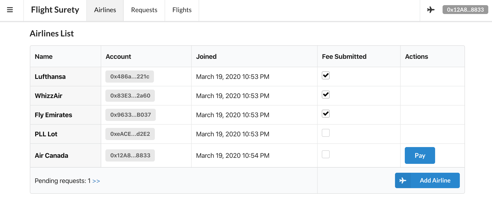
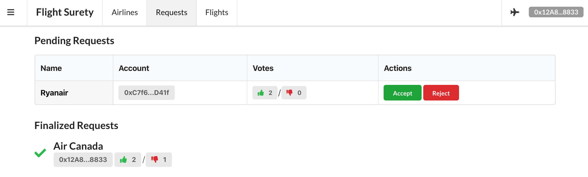
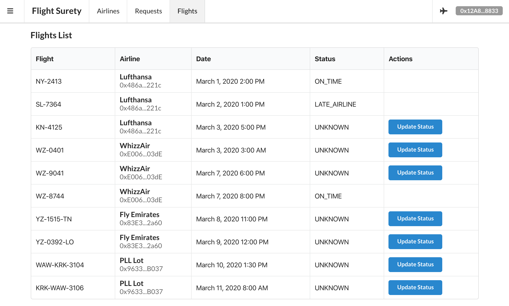
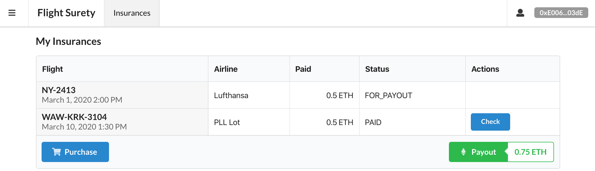

# Flight Surety DApp

This application is written in React and uses Semantic UI library components.
This document showcases some features of this app.

## Supported roles

Application supports two roles - _airline_ and _passenger_ and it decides which profile to use
based on the account that is selected in MetaMask. The current role is always presented
in the top right corner - icon with a plane means it's airline and user icon - passenger.

## Main Pages

For Airlines three pages are available:
* Airlines - presents all accounts that are accepted as airlines in this contract; enables paying funding fee, adding new airlines
and showing if there are any (and how many) pending requests that needs to be voted

* Requests - presents all pending and finalized request; enable voting on requests

* Flights - enables setting the flight state; when passenger fetches the flight status
Oracles will respond with the status set here

For Passenger there's one page available:
* Insurances - presents all the insurances that the passenger purchased so far with the amount paid and status;
also enables user to check flight status connected to the insurance and withdraw any available payouts

## Integration with MetaMask

Application is able to detect when the user has changed selected account MetaMask.
After that event application switches to airline or passenger mode automatically,
so there's no need to refresh the page after switching accounts.
